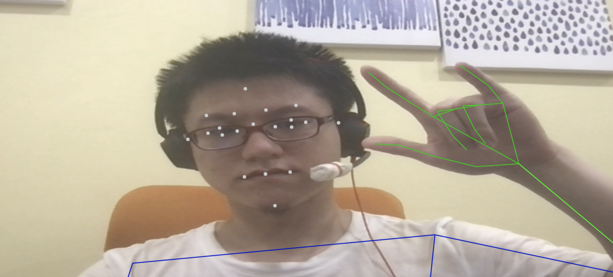

# Holistic Website Test

This project uses mediapipe holistic to calculate:
 - Facial landmarks
 - Pose
 - Hand gestures

[DEMO](https://wei-1.github.io/holistic-website-test/)

There are many Demos out there that are too complex (including the official example). This repository is the minimum setup that I developed that contains a reasonable amount of component.

There are 9 files in this repo:
 - README.md (this file)
 - index.html (include the dependencies and JS files)
 - sample.png (DEMO image)
 - control.js (main JS file)
 - worker.js (the file to run holictis in a different thread)
 - holistic.js (the edited holistic file)
 - Data Files x 3
   - pose_landmark_lite.tflite
   - holistic_solution_packed_assets.data
   - holistic_solution_simd_wasm_bin.wasm

We have the Data Files in the repository to speed up the page initialization.

If you want to try this repo by yourself, you can clone the project and use [http-server](https://www.npmjs.com/package/http-server) to host the `index.html` file.

----

### Note

 - There are several dependencies in the official MediaPipe Holistic model example.
 - After some research, this is the minimum dependencies that I will need to keep.

### Changelog

 - 2022-07-21
   - Initiation
 - 2022-09-30
   - Test web worker
